# Snack
  
 

## 👊 About Project
Spring Boot로 서버를 구축하고 Amazon AWS로 운영하고 있는 RxSwift를 기반 iOS 앱입니다. 
 
 

## 🏃 Installation
> 현재 Sever URL을 담고 있는 파일(APIConstants.swift)이 보안을 위해 올라가 있지 않습니다. 이 부분은 고정IP를 새로 생성하는 방향으로 팀원들과 의논중입니다.

 

## 🛠 Stack

>  RxSwift, RxCocoa, RxDataSources

RxSwift는 코드를 새로운 데이터에 반응하며 순차적으로 처리하게 함으로써 비동기 프로그래밍을 쉽게 도움

RxCocoa는 애플 환경의 애플리케이션을 제작하기 위한 도구들을 모아 놓은 Cocoa Framework를 Rx와 합친 기능을 제공

RxDataSources는 TableView 및 CollectionView를 더 Rx답게 사용

> SnapKit, Then

SnapKit은 짧은 코드로 autolayout을 표현할 수 있도록 도와주는 프레임워크

Then은 주로 프로퍼티(UI Components 포함)를 초기화 할 때 많이 사용, SnapKit과 함께 사용해서 UI 요소의 생성 및 초기화 작업

> Alamofire

Alamofire는 Swift에서 Http 통신을 하기 위해 이용되는 라이브러리

> StompClientLib

StompClientLib는 웹소켓, 그중에서도 Stomp(토픽을 Subscribe하고 있는 클라이언트에게 메시지를 전달하고 특정 토픽에 메시지를 Publish할 수 있도록 하는 프로토콜)을 사용하여 실시간 채팅을 구현

> MessageKit

MessageKit는 사용자 정의 가능한 채팅 UI 및 채팅 프로세스를 제공

> SwiftKeychainWrapper

SwiftKeychainWrapper는 사용법은 UserDefaults를 사용하는 것과 유사하게 사용하면서, 모든 키가 서비스 이름이라는 앱의 공통 식별자에 연결됩니다. 기본적으로 기본 Bundle Identifier를 사용

> ProgressHUD

ProgressHUD는 커스터마이징 되어진 ActivityIndicator를 보다 손쉽게 사용

> PasscodeKit

PasscodeKit는 페이스 아이디 및 암호를 설정할 수 있도록 도와주는 라이브러리

> Firebase

Firebase의 FCM을 이용한 Push Server 처리

 

## 📱 ScreenShots
<Blockquote>
실제 앱 구동화면입니다
</Blockquote>
<Blockquote>
회원가입 / 로그인
</Blockquote>

| 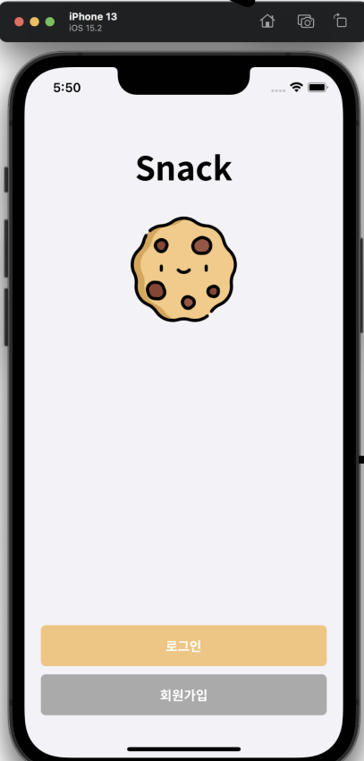 | 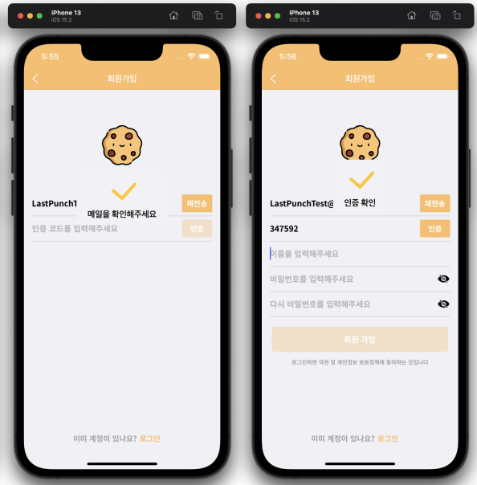 | 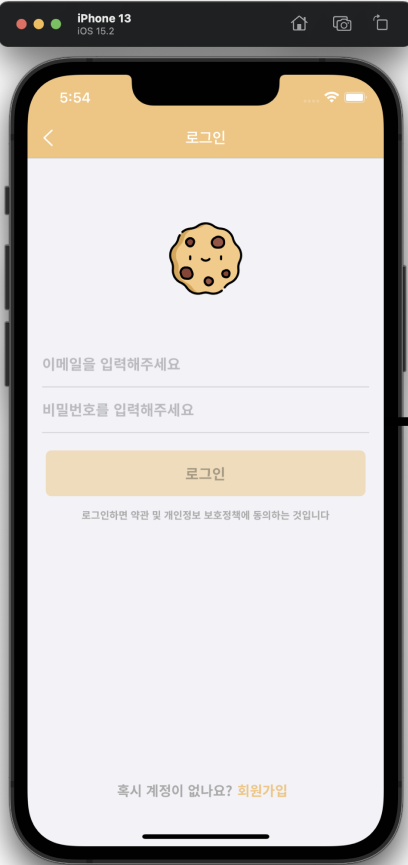 |
| :-: | :-: | :-: |
| 초기화면 | 회원가입 페이지 | 일반유저 로그인 |  |

###  1) 회원가입
- 이메일 형식 판별
  - @앞에는 대문자, 숫자, 소문자, 특수문자(._%+-)가 포함 가능
  - @뒤로는 대문자, 소문자, 숫자 그리고 . 기준으로 맨 마지막 문자가 2~64길이
- 이메일 중복검사
  - 이메일 판별 후, 중복버튼 활성화 
- 이메일 인증 코드 발송(Spring의 MailSender으로 SMTP 사용)
  - 중복검사 후, 전송 버튼으로 변경
- 6자리 인증 코드 검증
  - 코드가 입력되어 있지 않을때, 검증 버튼 비활성화
  - 6자리까지 입력가능
- 비밀번호 보기/숨기기
  - Toggle 기능
- 입력 중 이메일 변경시 초기화
  - 초기화시, 인증코드, 이름, 비밀번호/확인 초기화 및 회원가입 버튼 비활성화
  - 모든 정보(이메일, 인증코드, 이름, 비밀번호/확인)입력되어야 회원가입 버튼 활성화
- 로그인 페이지로 바로가기

###  2) 로그인
- 아이디 및 패스워드를 입력해 로그인, 비밀번호는 숨김
- 아이디 및 패스워드를 모두 입력할 경우, 로그인 버튼 활성화
- 아이디 또는 비밀번호가 틀릴 경우, 틀렸다는 알림
- 로그인시, AccessToken과 RefreshToken을 SwiftKeychainWrapper에 저장하여 사용자 보안 강화
- User 정보 또한 SwiftKeychainWrapper에 저장
- 회원가입 페이지로 바로가기

<Blockquote>
웰컴 - 워크스페이스 관련 기능 수행
</Blockquote>

| 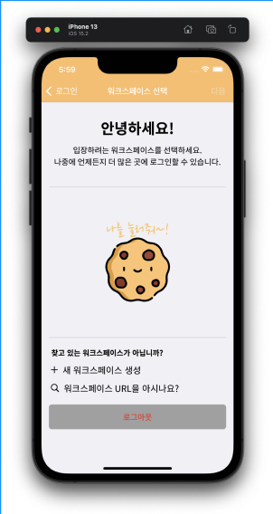 |  | 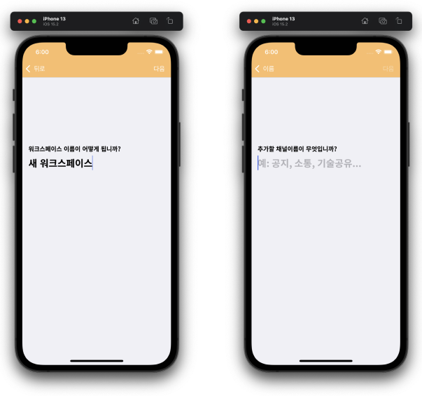 |
| :-: | :-: | :-: |
| 빈 워크스페이스 | 워크스페이스 선택 | 워크스페이스 추가 접속 |

###  3) 워크스페이스 선택/추가/고유주소로 접속
- 입장할 수 있는 워크스페이스가 없을경우, Snack 이미지 버튼을 통한 새 워크스페이스 생성 유도
- 입장할 수 있는 워크스페이스가 있을경우, 한개의 워크스페이스 선택 후 입장
  - 선택후, 다음 버튼 활성화
- 워크스페이스 목록 pull down 새로고침
- 워크스페이스 목록 pull up 5개씩 페이지네이션
- 새 워크스페이스 생성
  - 새 워크스페이스명 입력
    - "새 워크스페이스명"이라는 Default 명 제공
    - 1~16자리까지 입력 가능, 다음 버튼 활성화
    - 15자리를 넘을 경우, 숨겨진 경고 문구 노출
  - 채널명 입력후 입장
    - 1~16자리까지 입력 가능, 생성 버튼 활성화
    - 15자리를 넘을 경우, 숨겨진 경고 문구 노출
- 워크스페이스 고유주소(워크스페이스 id) 입력으로 입장
- 로그아웃

<Blockquote>
홈
</Blockquote>

| 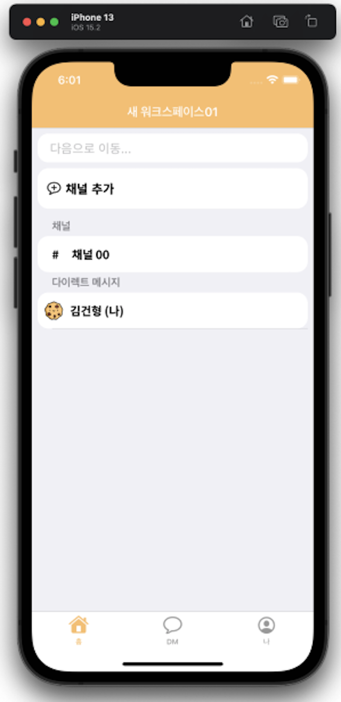 | 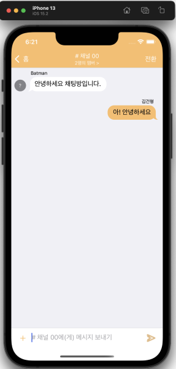 | 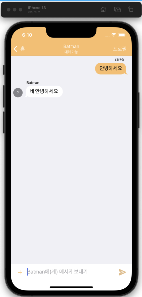 | 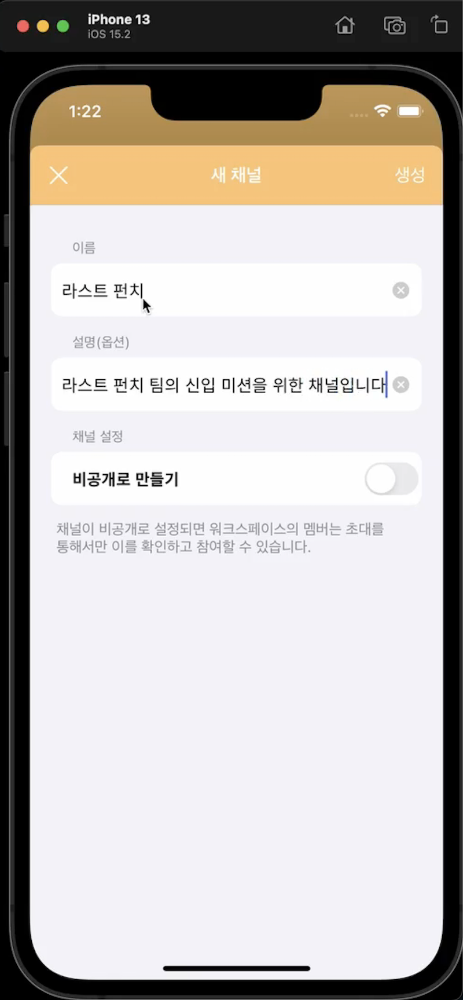 |
| :-: | :-: | :-: | :-: |
| 홈 탭 | 채널 입장(그룹채팅) | DM 입장 | 채널 추가 |
| 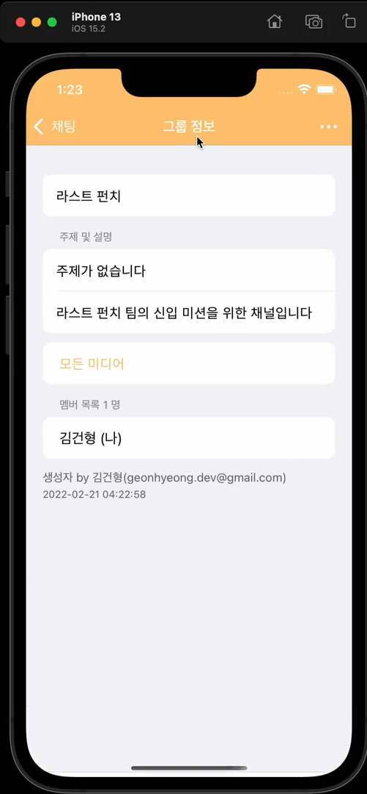 | | | |
| 채널 설정 |  |  |  |

### 4) 홈탭 및 그룹 채팅
- 홈 - 채널 및 DM Section으로 목록 제공
  - 채널의 본인일 경우 "(나)"를 제공
  - 채널 추가
  - (구연중) 접어두기
  
- 그룹 채팅
  - 사용자의 글일 경우 오른쪽, 아닐경우 왼쪽으로 노출
  - 카메라/사진/현재 위치 첨부
  - 시간 제공
  - (구연중) Title 선택시, 채널 관리
  - (구연중) 채널 관리
    - (구연중) 사용자 채널에 초대
    - (구연중) 채널에 속한 사용자 목록 - 선택시 프로필 및 DM
    - (구연중) 채널을 생성한 사용자일 경우, 채널 삭제
  
<Blockquote>
노트
</Blockquote>

| 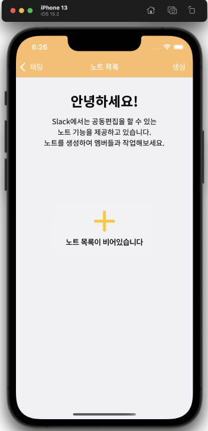 | 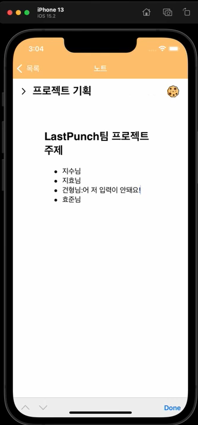 | 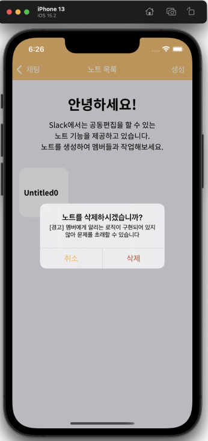 | |
| :-: | :-: | :-: | :-: |
| 노트 생성 | 노트 | 노트 삭제 |  |

### 5) 노트
- 각 채널마다 여러개의 노트를 생성하여 실시간 문서 편집을 제공
- 노트 추가 기능
- 노트 삭제 기능

<Blockquote>
DM
</Blockquote>

| 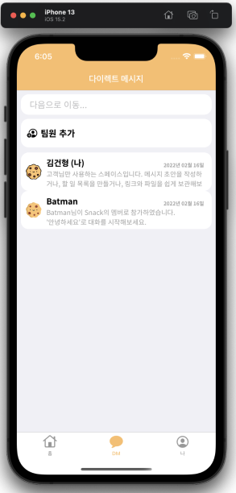 |  | 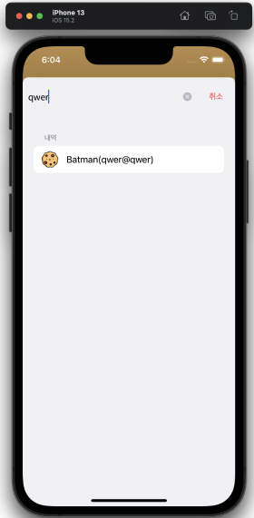 | 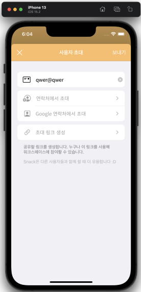 |
| :-: | :-: | :-: | :-: |
| DM 탭 | DM 입장(DM 채팅) | 사용자 검색 | 사용자 초대 |
| 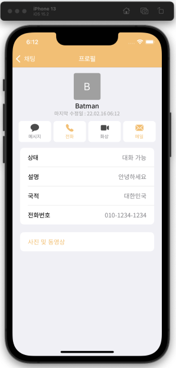 | | |  |
| 프로필 |  |  |  |

### 6) DM(Direct Message)탭 및 1:1 채팅
- DM - 사용자 목록 제공
  - (구연중) 유저 검색
  - 초대 기능
    - Snack 사용자 중 검색후, 존재할 경우 초대
    - 사용자가 아닐경우, 없다는 알림
  
- 1:1 채팅
  - 사용자의 글일 경우 오른쪽, 아닐경우 왼쪽으로 노출
  - 카메라/사진/현재 위치 첨부
  - 시간 제공
  - 프로필 보기 기능

<Blockquote>
나 (설정)
</Blockquote>

| 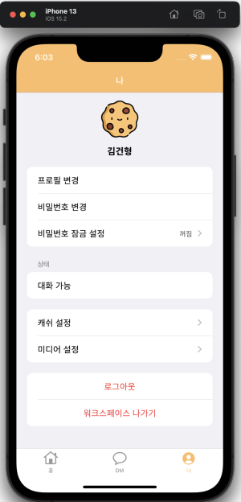 |  | 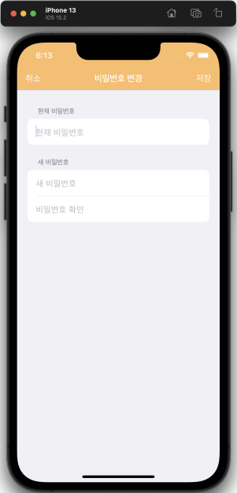 | 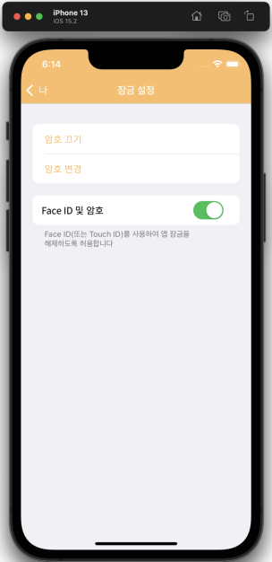 |
| :-: | :-: | :-: | :-: |
| 나 탭 | 프로필 수정 | 비밀번호 수정 | 패스코드 설정 |
| 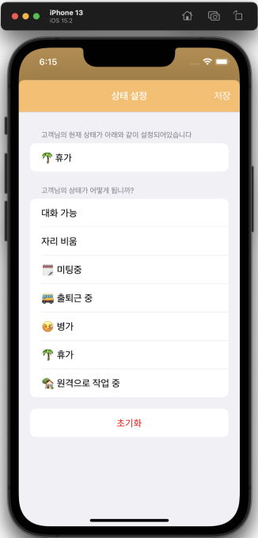 | 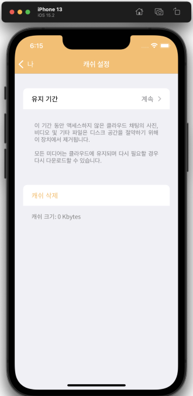 | 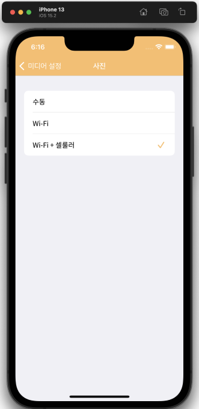 | |
| 상태 변경 | 캐쉬 설정 | 미디어 관리 | |

### 7) 나(설정)탭
  - 이름 - 이름, 설명, 국적, 전화번호 변경
  - 비밀번호 - 현재 비밀번호, 새 비밀번호/확인
  - 패스코드 - 앱 실행시 4자리 암호 설정 및 실행, 생체 아이디(Face ID) 
  - 상태 - 대화 가능, 자리 비움, 🗓 미팅중, 🏡 원격으로 작업 중...등 상태 변경
  - 캐쉬관리 - 디스크 공간을 절약하기 위해 장치에서 캐쉬 제거
  - 미디어 관리 - 저장된 모든 사진 관리

 

## 🛠 Architecture
### iOS 구조
> MVVM 패턴을 채택하였습니다. 화면 간 연결은 아래와 같이 구성되었습니다.

 

## 🤷 Difficult point / Problem
### WebView
- 
 

## 🔥 Feeling & Technical Achievements
### iOS 사이드
- 
